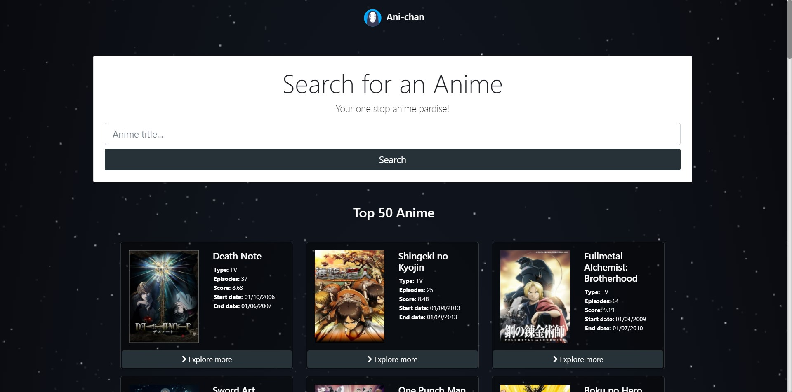
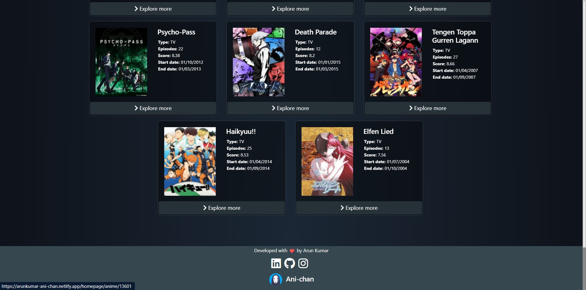
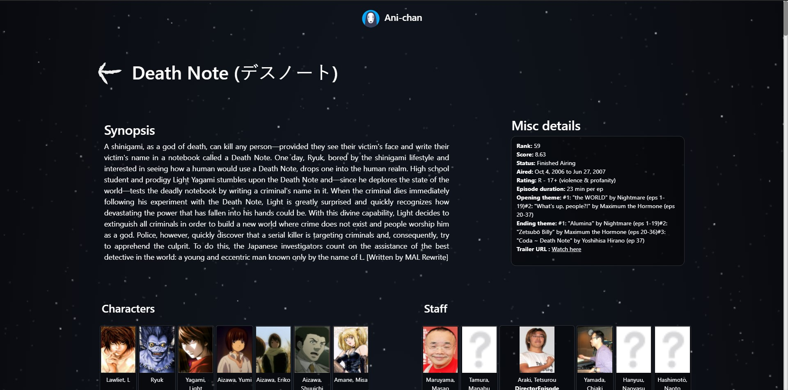
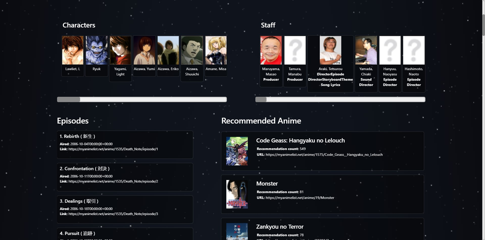
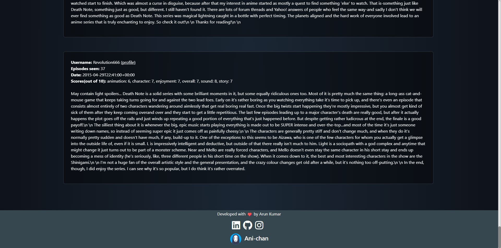

# Ani-chan

This repository contains one of my personal projects "Ani-chan".

Ani-chan is where the fellow otaku's can explore the depths of anime/manga.

Made using React.js, Bootstrap and Jikan API.

Deployed @ https://arunkumar-ani-chan.netlify.app/

## 1. Desktop View

### 1. Header

### 2. Footer

### 3. Anime Page

### 3. Anime Page - 2

### 3. Anime Page - 4

## 2. Mobile/Tablet View

### 1. 

### 2. 

